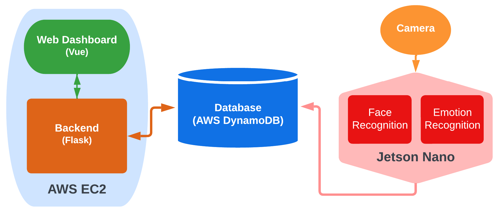

# LF2 - Easy Classroom Monitoring Tool for Teachers

**Go to the [wiki](https://github.com/dlccyes/LF2/wiki) to see full documentation**

See it in action!  

- <http://lf2-classroom-monitor.us-east-2.elasticbeanstalk.com/>
- <http://flask-env.eba-ts5yjdi9.us-east-2.elasticbeanstalk.com/> (backup)
- <https://classroom-helper-lf2.herokuapp.com/> (Heroku backup)

## What is this?

By placing a Jetson Nano with a camera in front of the classroom, you'll be able to monitor your classroom with a web dashboard. 

The program on Jetson Nano will take a shot periodically, do face & emotion recognition, and record the result to database. The webapp hosted on AWS will then pick up the new data and update the dashboard. From the dashboard, you'll know how many students have come to your class, and the general vibe of the classroom. With the positivity vs. time graph, you'll even know if your joke works!

## Tech Stack

- Web: Flask & Vue
- Web hosting: AWS EC2 (with Elastic Beanstalk)
- Database: AWS DynamoDB
- Live Capuring: Jetson Nano
- Face Recognition: Jetson Nano
- Emotion Recognition: AWS Rekognition

## System Architecture



## Emotion Recognition


### Types of Emotions

- SURPRISED
- HAPPY
- CALM
- CONFUSED
- SAD
- ANGRY
- FEAR
- DISGUSTED
- UNKNOWN

## Face Recognition


## Frontend Dashboard

There are two versions of frontend available. The default one is written in Vue, and the other is written in vanilla HTML/JavaScript/CSS + jQuery, rendered with Flask's template. You can switch to the latter one by setting `VUE` to `false` (or just remove it) in your [environment variables](.env_bak).

There are many features:

**Theme switcher**

You can toggle the theme by clicking the moon button at the top right.

**Time slider**

You can easily change the scope of time to watch by dragging the slider at the top of the page.

**Attendance**

You can see the last recorded attendance as well as the attendance vs. time chart to see the attendance of your classroom over time.

**Emotion**

You can see the positivity of the classroom over time as well as the emotion cloud to get an idea of the general vibe of the classroom in the scope of time you selected.

**Specific students**

Apart from seeing the overall condition of the classroom, you can also head to each student's page to see their attendance record.


## How to run the webapp locally?

### Download the codes

```
git clone https://github.io/dlccyes/LF2.git
```

### Prepare the environment

**Supply environment variables**

```
cp .env_bak .env
```
Fill `.env` with the correct AWS credentials. (Never commit it.)

**Install Python dependencies**

```
pip3 install -r requirements.txt
```

**Install Node dependencies**

```
cd vue
npm install
```

### Build the Vue frontend

```
cd vue
npm run build
```

### Run the Flask server

```
python3 application.py
```

And you're done! Head to <http://127.0.0.1:5000> to see the dashboard.

## How to run the register and the in-class monitor on Jetson Nano?
See ```README.md``` in ```jetson-nano``` folder.
